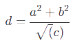

[](https://travis-ci.org/fegemo/bespoke-math) [](https://coveralls.io/github/fegemo/bespoke-math?branch=master) 

# bespoke-math

Use [KaTeX][katex] to include latex formulas into your bespoke.js presentation. Only the HTML elements with the
`math` class will be transformed through KaTeX (this is configurable, keep reading). For example, this markup:
`<div class="math">d = \frac{a^2+b^2}{\sqrt(c)}</div>` will render like:




Also, KaTeX will render the element either as a "full" math ("displaystyle") or as an inline math ("textstyle")
(inline is a bit shortened to fit a text line) depending on the HTML element used: `<span class="math">...</span>`
renders inline whereas  a `<div class="math">...</div>` or any other
element renders a "full" formula.

- Display style (full height):
  
- Text style (inline):
  


## KaTeX

KaTeX is a much lighter alternative to MathJax that allows you to write LaTeX formulas on the web.
Refer to their documentation on what syntax is supported.
The current version of KaTeX in use is [0.4.3][katex-version].

[katex-version]: https://github.com/Khan/KaTeX/releases/tag/v0.4.3

## Download

Download the [production version][min] or the [development version][max], or use a [package manager](#package-managers).

[min]: https://raw.github.com/fegemo/bespoke-math/master/dist/bespoke-math.min.js
[max]: https://raw.github.com/fegemo/bespoke-math/master/dist/bespoke-math.js
[katex]: http://khan.github.io/KaTeX/

## Usage

This plugin is shipped in a [UMD format](https://github.com/umdjs/umd), meaning that it is available as a CommonJS/AMD module or browser global.

For example, when using CommonJS modules:

```js
var bespoke = require('bespoke'),
  math = require('bespoke-math');

bespoke.from('#presentation', [
  math()
]);
```

When using browser globals:

```js
bespoke.from('#presentation', [
  bespoke.plugins.math()
]);
```

## Configuring bespoke-math

The default action is to transform every HTML element that has `.math` (e.g., &lt;span class="math"&gt;\vec{r} = \vec{S} + 2\vec{a}&lt;/span&gt;).
Furthermore, the formulas are considered inline if their element is a `span` or a full formula if the element is a `div` or any other HTML element.

To change that behavior, simply provide 1 or 2 arguments when instantiating the plugin:
- 1 argument: a string with the selector for math formulas - inline vs full formulas is still decided through the
  use of `span` (for inline) and anything else for full.
  - Example:
    ```js
    var bespoke = require('bespoke'),
      math = require('bespoke-math');

    bespoke.from('#presentation', [
      math('.formula, .math, .equation')
    ]);
    ```
    - Renders into KaTeX equations all elements with either one of the classes: `formula`, `math` and `equation`.
      A formula will be rendered inline if its element is a `span`, otherwise and it'll be a full formula.
- 2 arguments:  a string with the selector for inline formulas and a string for the full formula
  - Example:
    ```js
    var bespoke = require('bespoke'),
      math = require('bespoke-math');

    bespoke.from('#presentation', [
      math('.inline-math', '.math')
    ]);
    ```
    - Renders into KaTeX equations all elements with the class `inline-math` as inline and all elements with the
      class `math` as full formula.  


## Package managers

### npm

```bash
$ npm install bespoke-math
```

### Bower

```bash
$ bower install bespoke-math
```

## Credits

This plugin was built with [generator-bespokeplugin](https://github.com/markdalgleish/generator-bespokeplugin).

## License

[MIT License](http://en.wikipedia.org/wiki/MIT_License)
